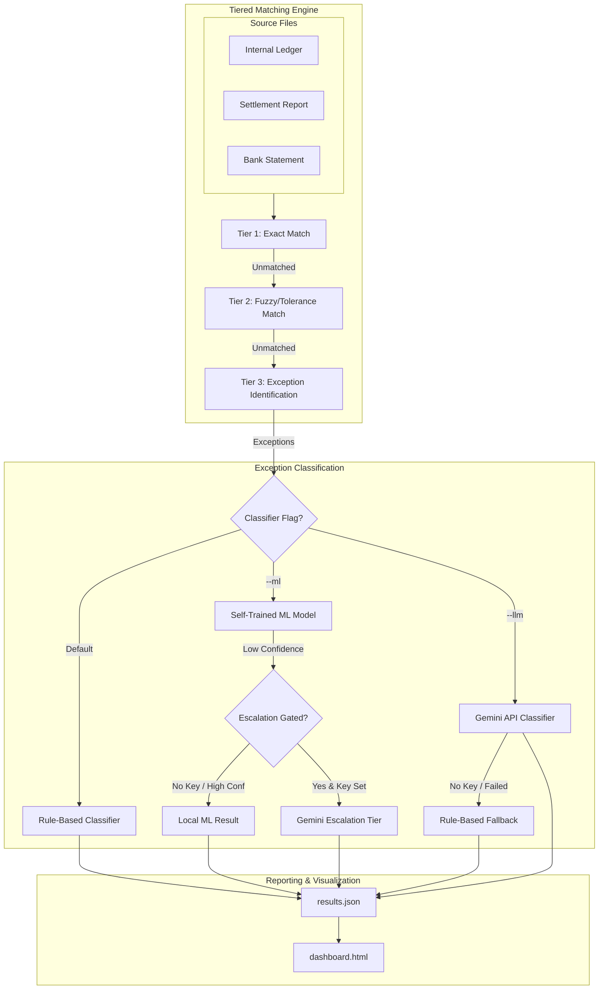

# ReconAgent

ReconAgent is a small finance reconciliation system that compares transactions across an internal ledger, a payment gateway and a bank statement.

The main idea is simple: **match what should have happened with what actually happened, and flag anything that doesn't make sense.**

## How it works

```text
Ledger
Gateway
Bank
  ↓
Upload & Validate
  ↓
Normalize the data
  ↓
Reconcile transactions
  ↓
Classify exceptions
  ↓
Review results
```

The system first tries to resolve transactions using deterministic checks. It handles exact matches, ID differences, small rounding differences, settlement delays and payout groups.

Transactions that cannot be safely matched are kept as exceptions instead of being forced into a match.

For those exceptions, the system can use a rule-based classifier, a self-trained ML model, or Gemini to help identify the likely cause.

## Architecture

```
data_generator.py  → three linked, deliberately-imperfect CSVs + ground truth
matcher.py         → Tier 1 (exact) → Tier 2 (fuzzy/tolerance) → Tier 3 (exception)
exception_classifier.py → reasons about cause for the Tier 3 tail
                          (rule-based fallback, or Gemini API if a key is set)
main.py            → orchestrates the pipeline, self-scores against ground
                      truth, writes results.json
dashboard.html      → renders results.json (already embedded — open directly,
                      no server needed)
controller.html     → Finance Controller workspace (upload → validate → reconcile)
controller_server.py→ local HTTP API for the controller workspace
```

### Finance Controller (upload workspace)

```bash
./venv/bin/python controller_server.py
# open http://127.0.0.1:8765/
```

Flow: **Control setup** → **Data validation** (strict money parsing, mapping preview, quarantine) → **Reconciliation** (frozen matcher) → **Exception review**. The default queue is exceptions; reconciled and pending rows sit on secondary tabs so a cleared match can still be audited. Invalid critical amounts block the run as `VALIDATION_FAILED`. Confidence scores appear only on uncertain exception classifications.

### Evaluation (held-out + adversarial)

Held-out sets (`easy_100` / `medium_100` / `hard_100`) and the adversarial
suites share one protocol: adapter → frozen matcher → `evaluator.py`.
The agent never reads labels. Matcher / classifier / held-out CSVs stay frozen.

```bash
./venv/bin/python evaluation_datasets/run_heldout.py
./venv/bin/python evaluation_datasets/run_adversarial.py
```

Details: `evaluation_datasets/EVALUATION.md`.



## What it can detect

Some of the cases handled by the system include:

* Exact matches
* ID and formatting differences
* Rounding differences
* Settlement delays
* TDS and gateway fees
* Partial and full refunds
* Duplicate gateway records
* Duplicate bank credits
* Missing settlements
* Missing bank credits
* Wrong transaction references
* Amount mismatches
* Ambiguous matches

## Data ingestion

The controller has a separate ingestion step before reconciliation.

```text
Upload
  ↓
Detect source
  ↓
Validate
  ↓
Preview mapping
  ↓
Reconcile
```

Financial values are checked before they reach the matcher.

The parser treats these differently:

```text
0.00       → valid zero
blank      → missing
₹4,500     → valid amount
abc        → invalid
```

A required invalid or missing monetary value blocks reconciliation instead of being silently converted to zero.

Invalid cells are reported with the file, row, field and error so they can be fixed before running the reconciliation.

## Matching

The matching process is deliberately conservative.

A transaction is only cleared when there is enough evidence to do so. Otherwise it becomes an exception or is sent for further review.

The system supports:

```text
Exact
Fuzzy
Tolerance
Many-to-one
One-to-many
Exception
```

The goal is not to match everything. It is to avoid saying that money is reconciled when it is not.

## Exception classification

Once matching is finished, unresolved transactions are classified.

There are three options:

**Rules** — fast and deterministic.

**ML** — a model trained on synthetic exception data.

**Gemini** — used when additional reasoning is useful, including low-confidence cases.

The result includes the suspected cause, confidence and the evidence used to explain the exception.

## Evaluation

The reconciliation engine was tested on three separate held-out datasets containing 100 transactions each.

|                           | Easy | Medium |  Hard |
| ------------------------- | ---: | -----: | ----: |
| Decision accuracy         | 100% |   100% |  100% |
| False matches             |    0 |      0 |     0 |
| Match precision           | 100% |   100% |  100% |
| Match recall              | 100% |   100% |  100% |
| Exception reason accuracy |  95% |  92.5% | 94.4% |

That gives **300/300 correct MATCH vs EXCEPTION decisions with zero false matches** on the current synthetic held-out tests.

These are synthetic datasets, so these numbers should not be treated as production accuracy.

## Running it

Create the environment and install the dependencies:

```bash
python3 -m venv venv
source venv/bin/activate
pip install -r requirements.txt
```

Run the normal pipeline:

```bash
python3 main.py
```

Run ML classification:

```bash
python3 main.py --ml
```

Run Gemini:

```bash
export GEMINI_MODEL=gemini-3.1-flash-lite
python3 main.py --llm
```

Run the held-out evaluation:

```bash
python3 evaluation_datasets/run_heldout.py
```

If `python` is not available on macOS, use:

```bash
./venv/bin/python evaluation_datasets/run_heldout.py
```

## Project structure

```text
reconagent/
├── main.py
├── matcher.py
├── exception_classifier.py
├── ingest_adapter.py
├── ingest_validate.py
├── money.py
├── validate_sources.py
├── predictions.py
├── train_model.py
│
├── controller.html
├── controller_server.py
├── dashboard.html
│
├── evaluation_datasets/
├── tests/
├── models/
├── batches/
└── results/
```

## The main idea

ReconAgent is built around one simple rule:

> **Match what can be proved. Flag what cannot.**

The system uses normal financial checks for straightforward cases and brings in ML or Gemini only when an exception needs more analysis.
# ReconAgent
